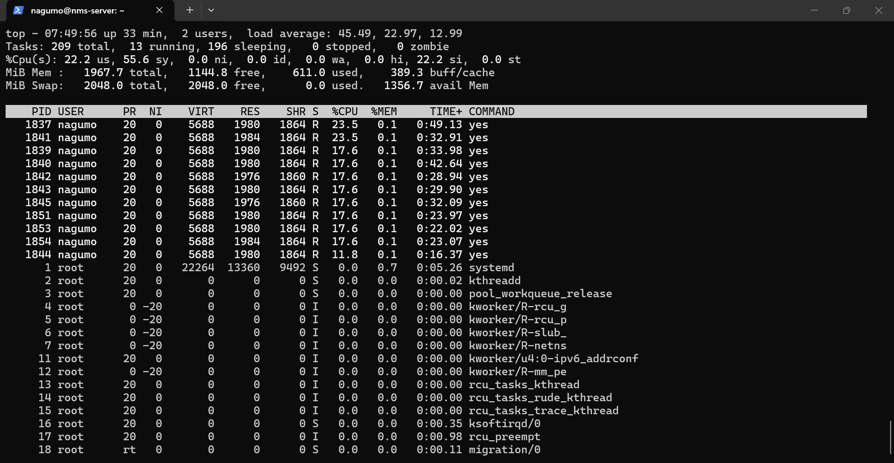
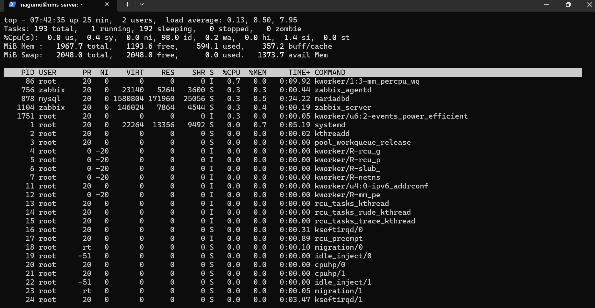

# Enterprise Network Monitoring & Troubleshooting Lab

## Overview

This project demonstrates a practical enterprise monitoring and troubleshooting environment using Zabbix and Ubuntu Server.

The lab follows a complete operational workflow:

**Monitor → Detect → Troubleshoot → Fix → Verify → Document**

## Lab Environment

The monitoring environment was built using:

- Ubuntu Server 24.04 LTS
- Zabbix 7.0
- Zabbix Agent
- MariaDB
- Apache2
- VirtualBox
- Cisco Packet Tracer
- SNMP
- Syslog
- Wireshark

- ## Network Configuration

The Ubuntu monitoring server runs as a virtual machine in VirtualBox.

### VirtualBox Network Adapters

- **Adapter 1 — NAT:** Provides Internet access.
- **Adapter 2 — Host-Only Adapter:** Provides communication between the Windows host and the Ubuntu monitoring server.

### Ubuntu Server Network

- Hostname: `nms-server`
- Monitoring IP: `192.168.56.10/24`
- Zabbix Agent port: `10050`

## Zabbix Configuration

A Zabbix host named `NMS-Server` was configured to monitor the Ubuntu Server.

The host uses the:

**Linux by Zabbix agent**

template.

### Zabbix Agent

- Host: `NMS-Server`
- Agent IP: `192.168.56.10`
- Agent port: `10050`
- Agent status: **Available**

The Zabbix Agent successfully communicates with the Zabbix Server and provides system monitoring data.

## Monitoring

Zabbix collects system performance metrics from the Ubuntu Server.

The monitored metrics include:

- CPU utilization
- Memory utilization
- Disk utilization
- System uptime
- Linux system performance metrics

The monitoring data is available through the Zabbix web interface under:

**Monitoring → Hosts → NMS-Server → Latest data**

## Troubleshooting Scenario: High CPU Utilization

A controlled CPU-load scenario was created to simulate a high CPU utilization incident.

The objective was to demonstrate the complete troubleshooting process:

**Detect → Troubleshoot → Fix → Verify**
### 1. Detect

Zabbix detected increased CPU utilization on the `NMS-Server` host.

During the test, CPU utilization reached approximately **18%**.


This represented the detection stage of the troubleshooting process.
### 2. Troubleshoot

The Linux `top` command was used to identify the processes responsible for the increased CPU utilization.

The output showed multiple `yes` processes consuming significant CPU resources.

Examples:

- PID 1840 — 57.4% CPU
- PID 1839 — 48.1% CPU
- PID 1844 — 41.3% CPU
- PID 1853 — 40.8% CPU

The system also showed **0.0% idle CPU**, confirming that the CPU was under heavy load.


### 3. Fix

The high CPU utilization was caused by multiple `yes` processes that were intentionally started to generate CPU load.

The processes were stopped using:

```bash
pkill yes
```

This terminated the `yes` processes and removed the artificial CPU load from the system.
### 4. Verify

After stopping the `yes` processes, CPU utilization returned to approximately **3%**.

Zabbix confirmed that CPU utilization had returned to a normal level after the artificial load was removed.



## Troubleshooting Methodology

The troubleshooting process followed a structured operational workflow:

1. **Monitor** — Zabbix continuously collects system performance metrics.
2. **Detect** — Increased CPU utilization is identified.
3. **Troubleshoot** — Linux `top` is used to identify the processes responsible for the CPU load.
4. **Fix** — The unwanted CPU-intensive processes are terminated.
5. **Verify** — Zabbix confirms that CPU utilization returns to a normal level.
6. **Document** — The incident, troubleshooting steps, and evidence are recorded.

## Tools Used

| Tool                | Purpose                                           |
| ------------------- | ------------------------------------------------- |
| Zabbix              | Infrastructure and system monitoring              |
| Zabbix Agent        | Collecting system metrics                         |
| Ubuntu Server       | Monitoring server and troubleshooting environment |
| MariaDB             | Zabbix database                                   |
| Apache2             | Zabbix web interface                              |
| VirtualBox          | Virtualized lab environment                       |
| Cisco Packet Tracer | Network topology and troubleshooting simulation   |
| SNMP                | Network monitoring protocol                       |
| Syslog              | Centralized event logging                         |
| Wireshark           | Network traffic analysis                          |

## Future Improvements

Planned extensions for the lab include:

* SNMP-based device monitoring
* Centralized Syslog collection
* Network traffic analysis with Wireshark
* Additional troubleshooting scenarios
* Network availability monitoring
* Interface and packet-loss monitoring
* Alerting and trigger configuration
* Technical incident documentation

## Important Lab Note

Cisco Packet Tracer is used in this project for network topology simulation and troubleshooting exercises.

Real SNMP and Syslog integration with Zabbix requires real network-capable devices, virtual network appliances, or another suitable network emulation environment.

Therefore, Packet Tracer devices are not presented as being directly monitored by the Zabbix server.

## Project Goals

This project demonstrates practical exposure to:

* Linux administration
* Infrastructure monitoring
* Network monitoring
* Troubleshooting
* Performance analysis
* Incident investigation
* Zabbix administration
* Technical documentation
